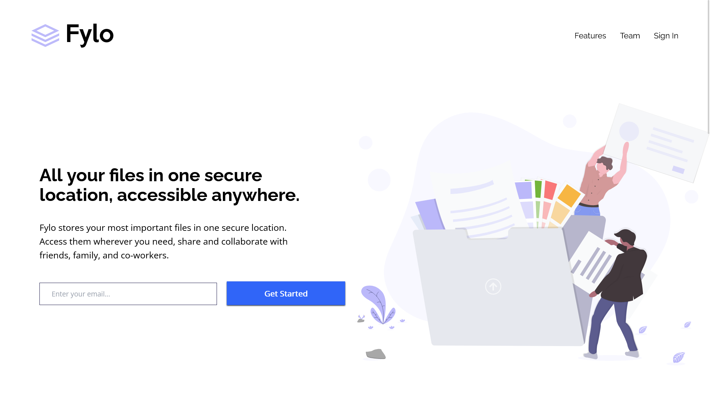

# Frontend Mentor - Fylo landing page with two column layout solution

This is a solution to the [Fylo landing page with two column layout challenge on Frontend Mentor](https://www.frontendmentor.io/challenges/fylo-landing-page-with-two-column-layout-5ca5ef041e82137ec91a50f5).

## Table of contents

- [Overview](#overview)
  - [The challenge](#the-challenge)
  - [Screenshot](#screenshot)
  - [Links](#links)
- [My process](#my-process)
  - [Built with](#built-with)
  - [What I learned](#what-i-learned)
  - [Continued development](#continued-development)
  - [Useful resources](#useful-resources)
- [Author](#author)
- [Acknowledgments](#acknowledgments)

## Overview

### The challenge

Users should be able to:

- View the optimal layout for the site depending on their device's screen size
- See hover states for all interactive elements on the page

### Screenshot



### Links

- Solution URL: [@FrontendMentor.io](https://www.frontendmentor.io/solutions/fylo-landing-page-with-two-column-layout-challenge-hub-kL6p3BTjR)
- Live Site URL: [@Vercel:](http://prj-14-fylo-landing-page-with-two-column-layout.vercel.app/)

## My process

### Built with

- Semantic HTML5 markup
- CSS custom properties
- Flexbox
- CSS Grid
- Mobile-first workflow
- [Tailwindcss](https://tailwindcss.com/) - CSS Framework

### What I learned

How to arrange itemns in flex container:

```html
<section
  class="py-16 lg:mx-0 lg:flex lg:flex-nowrap lg:items-center lg:justify-center lg:pl-0 lg:mb-32"
>
  <div class="basis-2/4 lg:order-2"></div>
  <form action="" class="basis-2/4 lg:order-1"></form>
</section>
```

Styling based on a sibling state in Forms:

```html
<form action="" class="basis-2/4 lg:order-1">
  <h1
    class="font-bold font-raleway text-2xl text-center px-4 my-8 lg:text-4xl lg:text-left lg:pl-20 lg:pr-24"
  >
    All your files in one secure location, accessible anywhere.
  </h1>
  <p
    class="text-center text-xs px-8 mb-6 lg:px-0 lg:text-left lg:text-lg lg:pr-24 lg:pl-20"
  >
    Fylo stores your most important files in one secure location. Access them
    wherever you need, share and collaborate with friends, family, and
    co-workers.
  </p>
  <input
    type="email"
    placeholder="Enter your email..."
    class="block required:ring-red-600 peer mx-auto my-4 border-veryDarkBlue border px-6 py-3 text-xs rounded-xs w-10/12 lg:inline-block lg:text-sm lg:w-6/12 lg:ml-20 lg:mb-0"
  />
  <button
    type="submit"
    class="block mx-auto my-4 bg-brightBlue text-white px-6 py-3 text-[12px] font-bold rounded-xs w-10/12 shadow-gray-800 shadow-sm hover:cursor-pointer hover:opacity-60 lg:inline-block lg:text-base lg:w-4/12 lg:ml-4 lg:mb-2"
  >
    Get Started
  </button>
  <p
    class="mt-0 mx-8 md:mx-20 lg:ml-20 invisible peer-invalid:visible text-red-600 text-sm"
  >
    Please check your email
  </p>
</form>
```

### Continued development

Future projects will be developed using Vue.JS when interactivity must be included.

### Useful resources

- [TailwindCSS Directives](https://tailwindcss.com/docs/functions-and-directives) - Use of @apply directive
- [Form states](https://tailwindcss.com/docs/hover-focus-and-other-states#form-states) - Style form elements in different states using modifiers like required, invalid, and disabled.
- [Customizing Colors in TailwindCSS](https://tailwindcss.com/docs/customizing-colors) - Adding personalized color names to be used in tailwindcss.
- [Customizing Fonts in TailwindCSS](https://tailwindcss.com/docs/font-family#using-custom-values) - Adding Google fonts to be used in tailwindcss.

## Author

- Website - [Gustavo Sanchez](https://www.gusanche.dev)
- Frontend Mentor - [@gusanchedev](https://www.frontendmentor.io/profile/gusanchedev)
- Github - [@gusanchedev](https://www.github.com/gusanchedev)
- Twitter - [@gusanchedev](https://www.twitter.com/gusanchedev)
- Linkedin - [gusanchedev](https://www.linkedin.com/in/gusanchedev/)

## Acknowledgments

Thanks to Mariapaz for being my friend and support 💙
